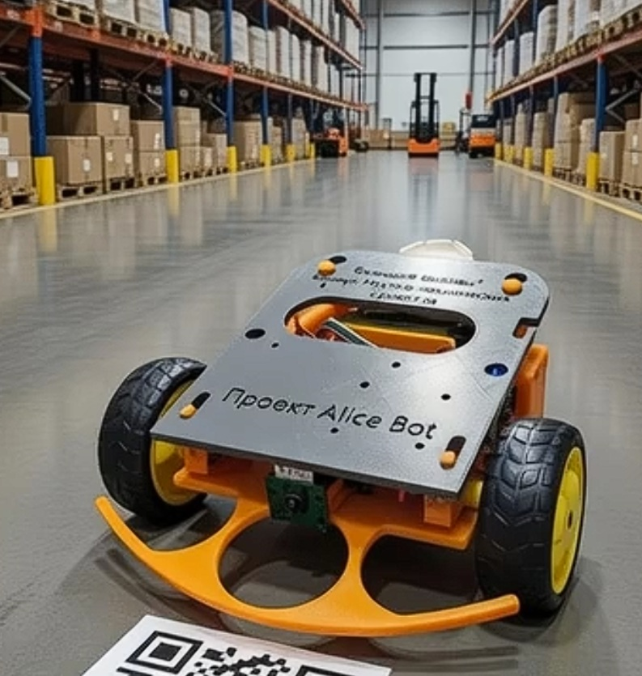

<p align="center">
  
</p>

# Alice's Bot: Autonomous Smart Follower 🤖

Мобильный робот на базе Raspberry Pi 4 с элементами искусственного интеллекта и удаленным веб-управлением. 
Проект разработан в рамках Международного конкурса научно-технологических проектов **«Большие вызовы»** (направления: «Транспортно-логистические системы, морские, авиационные и беспилотные технологии» / «Большие данные, искусственный интеллект, автоматизированные системы и информационная безопасность»).

Робот может управляться вручную через мобильный веб-интерфейс (с трансляцией видео от первого лица), а также умеет автономно ездить за оператором или объектом, ориентируясь по визуальным ArUco-маркерам.

<p align="center">
  
</p>

---

## 🧠 Как это работает (Архитектура и Алгоритмы)

Главная фишка программной части (Python 3) в том, что она работает в два независимых потока (через библиотеку `threading`). Один поток постоянно анализирует зрение и рулит моторами, а второй — держит веб-сервер Flask и отдает видео без тормозов.

1. **Компьютерное зрение (OpenCV + Picamera2):** Скрипт захватывает кадр в высоком разрешении для FPV, но для модуля машинного зрения программно ужимает его и переводит в ЧБ. Алгоритм ищет ArUco-маркер (словарь `DICT_4X4_50`) и вычисляет его центр.
2. **Автопилот (П-регулятор):** Если робот видит маркер, программа считает, насколько его центр отклонился от центра камеры. Это отклонение умножается на коэффициент, и разница подается на колеса. В итоге робот плавно подруливает без рывков.
3. **Система безопасности «Автостоп»:** Чтобы робот не врезался в ноги (или в кота), алгоритм непрерывно анализирует ширину маркера. Как только она превышает 180 пикселей (~30 см до объекта), моторы экстренно останавливаются.
4. **Zero-ping интерфейс:** В мобильном браузере обычные клики по кнопкам управления имеют огромную задержку. Я переписала HTML-шаблон Flask, заменив стандартные клики на прямую обработку касаний экрана (`ontouchstart` / `ontouchend`). В итоге отклик стал мгновенным, как на аппаратном джойстике.

---

## 🛠 Железо (Hardware)

* **Мозг:** Одноплатный микрокомпьютер Raspberry Pi 4.
* **Глаза:** Компактный модуль камеры OV5647 (подключен по CSI).
* **Шасси:** Спроектировано мной и напечатано на 3D-принтере (STL-файлы лежат в папке `3d_models`). В качестве пассивного третьего колеса интегрирован гладкий шар от роликового дезодоранта.
* **Драйвер моторов:** Промышленный модуль L298N с радиатором. *(Изначально я использовала компактный L9110S, но он сгорел во время тестов от высоких пусковых токов ТТ-моторов, поэтому схему пришлось переделать под более мощный ключ).*
* **Питание (Два контура):** Сборка 2S Li-ion 18650 (7.4В) питает напрямую драйвер моторов. Для питания чувствительной логики Raspberry Pi используется понижающий импульсный DC-DC преобразователь (выдает стабильные 5В напрямую на пины GPIO 4 и 6).

---


## 🚀 Установка и запуск

1. Склонируйте репозиторий на вашу Raspberry Pi:

```bash
git clone https://github.com/ezicvtumane/pi-smart-follower.git
cd pi-smart-follower
  ```
2. Установите зависимости (камера Picamera2 должна быть включена в настройках ОС):

  ```bash
  pip install -r requirements.txt
  ```
4. Запустите основной скрипт:
  ```bash
  python3 main.py
  ````
5. Откройте интерфейс управления в браузере смартфона или ПК (устройства должны быть в одной Wi-Fi сети):
  ```
  http://<IP_АДРЕС_RASPBERRY>:5000
  ```
---

## ⚙️ Автозагрузка при включении (через systemd)

Чтобы робот был полностью автономным и не требовал подключения по SSH для запуска кода, настроена системная служба `systemd`. Она автоматически поднимает скрипт при включении питания, ожидая подключения Raspberry Pi к Wi-Fi сети (чтобы сервер Flask не упал с ошибкой сети).

1. Создайте файл службы:
```bash
    sudo nano /etc/systemd/system/alicebot.service
```
2. Скопируйте в него содержимое файла `alicebot.service` из этого репозитория.

3. Включите автозагрузку командами:
```bash
    sudo systemctl daemon-reload
    sudo systemctl enable alicebot.service
    sudo systemctl start alicebot.service
```
---

## 🔮 Перспективы развития (Roadmap)

В будущем планируется масштабный апгрейд робота, который переведет его из класса прототипов в полноценную платформу:
* **Внедрение нейросетей:** Переход на Raspberry Pi 5 + AI Kit. Использование легковесных сверточных нейросетей (например, YOLOv8) для детекции людей и управления жестами без бумажных маркеров.
* **Интеграция в Умный дом (IoT):** Подключение робота к серверу Home Assistant по протоколу MQTT для создания «роевого интеллекта» (swarm robotics) и диспетчеризации.
* **Безопасность и автономность:** Установка модуля BMS для аккумуляторов и ультразвуковых сонаров для полностью безопасного перемещения и автовозврата на зарядную станцию.

---

## 🎥 Демонстрация работы

Видео полевых испытаний алгоритмов (езда за меткой, автостоп, интерфейс):
* 📹 [Тест мобильного управления, следования за меткой и автостопа](https://disk.yandex.ru/i/8JQ_mCUT42CxUg)
* 📹 [Тест следования по ArUco маркеру](https://disk.yandex.ru/i/dgs2dP-XnfjGSw)
* 📹 [Тест FPV и следование за котом Серго](https://disk.yandex.ru/i/KrElrjvzCOmklQ)

---
**📝 Автор:** Ковалева Алиса, ученица 9-го класса ГБОУ СОШ №282 г. Санкт-Петербурга (2026 г.). Проект выполнен в рамках инженерно-исследовательской работы.
